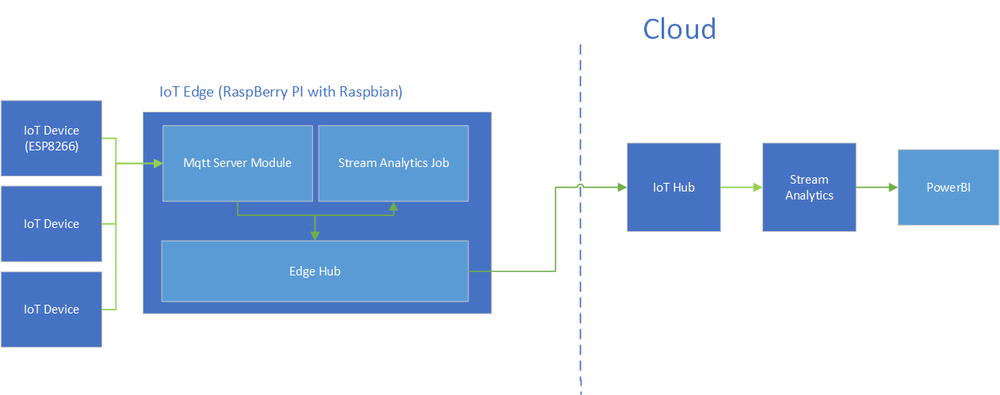
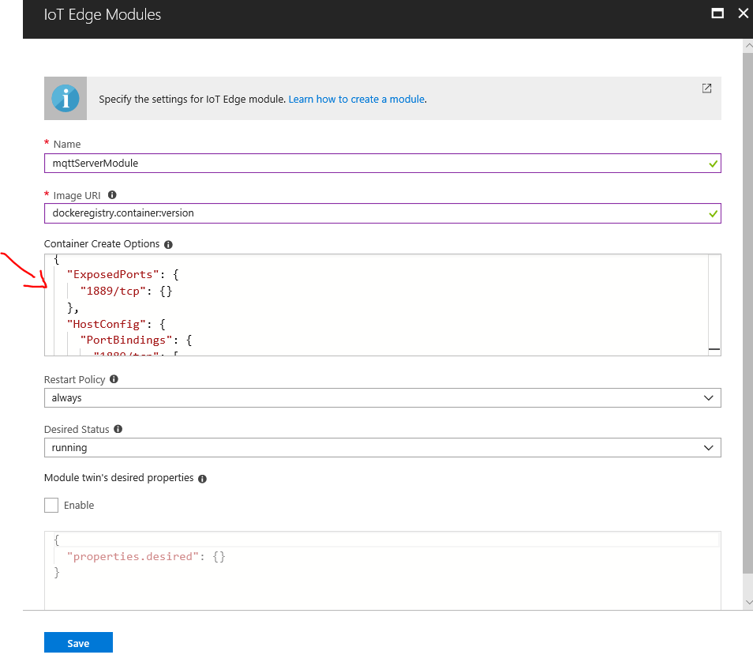
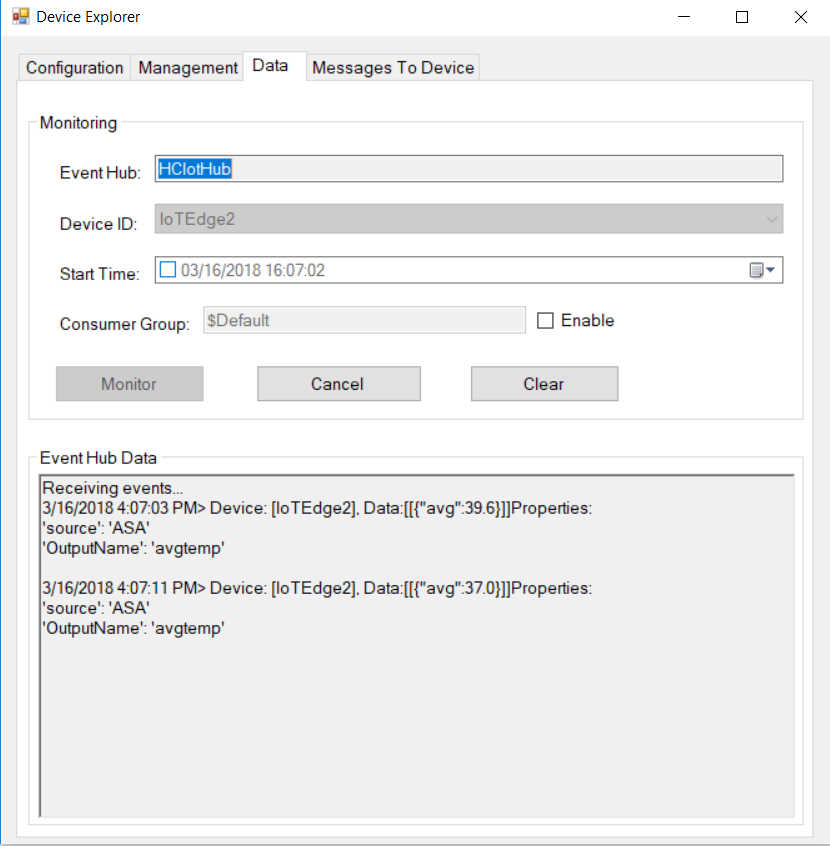
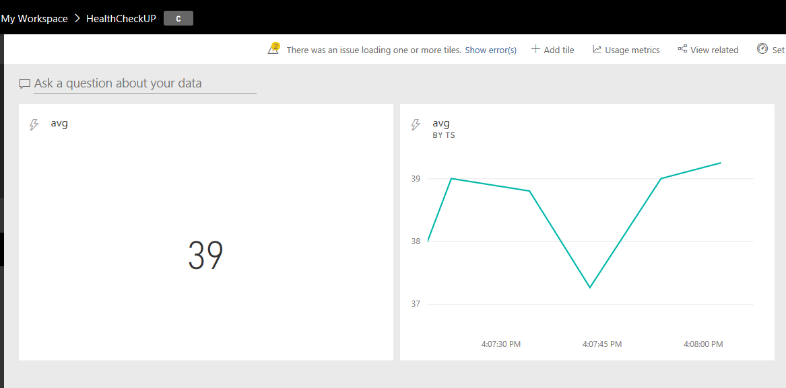

# Healthcare quality monitoring solution on Azure IoT Edge - Building Custom MQTT Server Module for Azure IoT Edge

**Repository structure:**

**Readme** - detailed project description

**ESPSimModule** - IoT Edge Module containing simulated ESP device, which generates messages with temperature data and sends them to MQTT Server Module

**CustomCommModule** - IoT Edge Module containing MQTT Server module for IoT Edge


Microsoft teamed up with research team from Technical University of Kosice - Slovakia to work on PoC version of Health Checkup solution built on top of several Azure services (IoT Hub, IoT Edge, Stream Analytics). Health Checkup is solution which was created in reaction to low quality and low effectivity of home healthcare services provided to long-term sick or handicapped  patients. 

Health Checkup solution is concept of cognitive health care platform which focuses on monitoring of quality of healthcare services using IoT and advanced data analysis.  On one side Health Checkup has ambition to monitor, whether provided healthcare support is provided in correct way, on the other side, it aims to make healthcare more efficient by providing an alternative to paper forms, that need to be filled by healthcare assistants everyday to record executed healthcare procedures  and plus provide knowledge base by the hand in the tablet e.g. using bot.

We can split solution to three main parts: 

- Data collection and real time analysis
- Advanced data processing (including Machine Learning algorithms)
- Web portal/ application/ Chat Bot


## Implementation of data collection and real time analysis

During our cooperation we have worked on first mentioned - data collection and real time analysis

**Main requirements** for this part were:

- Solution has to be easy to deploy, no extra wires etc.
- It should be available even in case of internet connection or data center failure
- Cost effective - as the healthcare assistance itself is expensive enough, solution cannot add greatly to the costs. It should utilize available computation resources. 

### **Azure IoT Edge in Health Checkup solution**

Based on above stated requirements we have decided to utilize **[Azure IoT Edge](https://docs.microsoft.com/en-us/azure/iot-edge/how-iot-edge-works)** to build prove of concept (PoC).. Azure IoT Edge is edge computing service built on top of Docker containers, which allows you to move cloud analytics and custom business logic to edge devices. It allows you to collect, filter and aggregate data directly within your own infrastructure. It works on the principle of Edge Hub, which takes role of local IoT Hub and modules which are responsible for message processing (in some cases receiving as well), while they output results back to Edge Hub, which acts as a sort of service bus. IoT Edge runtime takes care of message routing between the modules and cloud.  

In our case IoT Edge runs on Raspberry PI III device with Raspbian OS. It receives data from sensor devices (built on top of ESP8266 board), filter data on the edge and sends aggregated data to IoT Hub, where they are picked up and sent to PowerBI for real time analysis. Architecture of the solution is following: 




### IoT Edge modules architecture consideration:

While architecting the solution we have first experimented with capability of IoT Edge to act as an [transparent gateway](https://docs.microsoft.com/en-us/azure/iot-edge/how-to-create-transparent-gateway) which would allow us to send data from IoT devices (sensors) thru IoT Edge to IoT Hub in cloud. Even though there would be no need to build custom message receiving module, there were few downsides to this solution: 

- IoT Edge acting as gateway **requires TLS communication**. Even though ESP device has enough computation power [to support TLS](http://www.instructables.com/id/Using-TLS-V12-on-ESP8266/), it is large overhead and is not needed in our scenario from security perspective.
- When trying to connect to IoT Edge from device we were not able to reach the host (see this issue: https://github.com/Azure/iot-edge/issues/536 ) 
- Please also note, that when you follow instructions to generate certificates for dev purposes, there is issue in IoTSDK certs1.ps powershell file as there is undefined parameter. When following instruction you should edit file in following way: https://github.com/MicrosoftDocs/azure-docs/issues/5474 

Due to these findings, we have decided to implement custom module, which implements MQTT server using MQTTNet nuget packages. This way we use IoT Edge as a gateway with **protocol translation pattern** where we use our own module to bypass the TLS requirement. 


## Implementation steps:

### Installation of IoT Edge to Raspbian

As mentioned above, we have used Raspberry PI as our device to run IoT Edge.  For installation you need to follow these instructions from documentation:  https://docs.microsoft.com/en-us/azure/iot-edge/quickstart-linux .  **Note** following before installation:

There were two findings during installation: 

- **Docker installation** should be done thru following command *"curl*
  *-sSL <https://get.docker.com> | sh"*   as apt-get did not include suitable packages for Raspbian distribution

- Before installing IoT Edge, there is need to **install two python libraries** (libffi-dev
  libssl-dev) as these are not installed by implicitly.  Run following commands: 

  *"sudo pip install --upgrade setuptools pip"*

  *"sudo apt-get install python2.7-dev libffi-dev libssl-dev"*

  (Kudos to jonbgallant on github https://github.com/Azure/iot-edge/issues/419)


### **Creating custom MQTT Server module using .NET Core and deploying it to Raspbian ARM Device**

Thanks to .NET Core, we are able to create module, which is capable to run on both Linux and Windows as well. You can find step by step guide how to develop custom C# module in [this tutorial](https://docs.microsoft.com/en-us/azure/iot-edge/tutorial-csharp-module )

#### Selecting correct base docker image

In order to deploy container with .NET Core module to IoT Edge running on **Raspbian ARM** Device you need to use specific docker base image. To do so we have created subfolder within solution folder, called Raspbian and copied Linux dockerfile to it and changed base image references to point to suitable ARM .NET Core image.

```dockerfile
FROM microsoft/dotnet:2.0-runtime-stretch-arm32v7 

ARG EXE_DIR=.

WORKDIR /app

COPY $EXE_DIR/ ./

CMD ["dotnet", "{yourmodule}.dll"]
```

### Implementing MQTT Server functionality   

To implement MQTT Server functionality within our module we have used **[MQTTnet.AspNetCore](https://www.nuget.org/packages/MQTTnet.AspNetCore/)** nuget package which is .NET Core implementation of MQTTnet package. (For installation of nuget package in Visual Studio Code we recommend use [NuGet Package Manager extension](https://marketplace.visualstudio.com/items?itemName=jmrog.vscode-nuget-package-manager))

Code is based on the template code from the building custom C# module tutorial. Bellow is stated our implementation of Main method. Thanks to MQTTnet libraries implementation is quite simple:

```C#
...
using MQTTnet;
using MQTTnet.Server;

static void Main(string[] args)
{
    // The Edge runtime gives us the connection string we need -- it is injected as an environment variable
    string connectionString = Environment.GetEnvironmentVariable("EdgeHubConnectionString");

    // Wait until the app unloads or is cancelled
    var cts = new CancellationTokenSource();
    AssemblyLoadContext.Default.Unloading += (ctx) => cts.Cancel();
    Console.CancelKeyPress += (sender, cpe) => cts.Cancel();

    // Cert verification is not yet fully functional when using Windows OS for the container
        bool bypassCertVerification = RuntimeInformation.IsOSPlatform(OSPlatform.Windows);
        if (!bypassCertVerification) InstallCert();
    //Creating IoTHubModuleClient
    MqttTransportSettings mqttSetting = new MqttTransportSettings(TransportType.Mqtt_Tcp_Only);
    if (bypassCertVerification)
    {
        mqttSetting.RemoteCertificateValidationCallback = (sender, certificate, chain, sslPolicyErrors) => true;
    }
    ITransportSettings[] settings = { mqttSetting };

    Console.WriteLine("OpeningIoTHubClient");
    // Open a connection to the Edge runtime
    DeviceClient ioTHubModuleClient = DeviceClient.CreateFromConnectionString(connectionString, settings);
    ioTHubModuleClient.OpenAsync().Wait();
    
    // Start a MQTT server on port 1889
    var optionsBuilder = new MqttServerOptionsBuilder()
        .WithConnectionBacklog(100)
        .WithDefaultEndpointPort(1889);

    var mqttServer = new MqttFactory().CreateMqttServer();
    mqttServer.StartAsync(optionsBuilder.Build()).Wait();

    //On Message Received log to console, and output to IoT Edge Hub
    mqttServer.ApplicationMessageReceived += new EventHandler<MqttApplicationMessageReceivedEventArgs>( (o, mqttArgs) => {
        Console.WriteLine(System.Text.Encoding.UTF8.GetString(mqttArgs.ApplicationMessage.Payload));
        ioTHubModuleClient.SendEventAsync("output1", new Message(mqttArgs.ApplicationMessage.Payload));
    });

    Console.ReadLine();
    WhenCancelled(cts.Token).Wait();
}

```


### **Deploying MQTT Server Module to IoT Edge**

In order to deploy MQTT Server Module to IoT Edge module you need to build image using docker file referencing arm .NET Core image and push image to repository (e.g. Azure Container Registry). Again steps described in [tutorial](https://docs.microsoft.com/en-us/azure/iot-edge/tutorial-csharp-module ). Note that in our scenario there are two steps that differ from the tutorial. These are stated bellow. **Note:** Do not forgot to login to container registry from the IoT Edge runtime using iotedgectl login command.

#### Exposing port on container

When registering our new MQTT Server Module, we needed to define Docker Container Create Options for module in order to expose port 1889 and map communication to container's internal port 1889. These can be achieved in following way from Azure portal, when adding new module:



In the Container Create Options field we need to provide following json:

```json
{
  "ExposedPorts": {
    "1889/tcp": {}
  },
  "HostConfig": {
    "PortBindings": {
      "1889/tcp": [
        {
          "HostPort": "1889"
        }
      ]
    }
  }
}
```

**Note!**: Be aware that if you are testing module on localhost on Windows development machine, you can address the module thru localhost:1889 address only from Windows Insider Build 17025. Before this build Windows did not support address loopback for docker and you needed to access container thru their NATed IP Address.  To obtain IP Address of container run "*docker Inspect {nameofcontainer}*" command.

### Setting correct Routes for message routing 

IoT Edge runtime implements routing rules, so messages are routed thru Edge IoT Hub to correct modules.  In our case we implemented following routing logic, where messages from devices are ingested by MQTT Server Module, which outputs these messages to Edge IoT Hub which directs them to Stream Analytics module (described in next section), which aggregates data and sends them to cloud IoT Hub (so called upstream). Rules defined during modules deployment process look like this:

```json
{
  "routes": {
    "mqttserverToAsa": "FROM /messages/modules/{mqttServerModuleName}/outputs/output1 INTO     BrokeredEndpoint(\"/modules/{StreamAnalyticsModuleName}/inputs/temperature\")",
    "asaToCloud": "FROM /messages/modules/{StreamAnalyticsModuleName}/* INTO $upstream"
  }
}
```

You should provide your names of MQTT Server Module and Stream Analytics Module. 

Now when you deploy module, it will be addressable on port 1889 and when you run Docker PS command, you should see it in the list of running containers. In next step we show how we have implemented Stream Analytics Module.

### **Stream Analytics Module**

Azure IoT Edge allows you to run specific type of Stream Analytics Job directly on the edge device. This job can utilize rich Stream Analytics query language and windowing offered by Stream Analytics, but has one major difference on the side of inputs and outputs. It can only read and write messages from Edge Hub.

You can create your own Stream Analytics module by following this [tutorial](https://docs.microsoft.com/en-us/azure/iot-edge/tutorial-deploy-stream-analytics).

In our case implementation of SA job was rather simple:

```sql
SELECT  
   Avg("temp") 
INTO 
   AvgTemp 
FROM 
   temperature TIMESTAMP BY timeCreated 
GROUP BY TumblingWindow(second,60)
```

In our job we are aggregating data with tumbling window of 60 seconds as it is not necessary to monitor patient's temperature in real time as there is no expectation of sudden changes. This way we also limit number of messages sent to cloud and this way also cost for the solution.

### **Simulated device**

To test our modules easily and to send data to IoTEdge we have created .NET Core console application which utilize [MQTTnet.AspNetCore](https://www.nuget.org/packages/MQTTnet.AspNetCore/) nuget package as well as besides server functionality it provide MQTT client functionality as well. Bellow you can find implementation of this application:

```c#
namespace ESPSimModule
{
    using System;
    using System.IO;
    using System.Runtime.InteropServices;
    using System.Runtime.Loader;
    using System.Security.Cryptography.X509Certificates;
    using System.Text;
    using System.Threading;
    using System.Threading.Tasks;
    using Microsoft.Azure.Devices.Client;
    using Microsoft.Azure.Devices.Client.Transport.Mqtt;
    using MQTTnet;
    using MQTTnet.Client;

    class Program
    {

        static async Task Main(string[] args)
        {

            // Create a new MQTT client.
            var factory = new MqttFactory();
            var mqttClient = factory.CreateMqttClient();
           // Use TCP connection
           //provide address of mqttServerModule
            var options = new MqttClientOptionsBuilder()
                .WithTcpServer("localhost", 1889) // Port is optional
                .Build();
            

            Random r = new Random();
            try{
                await mqttClient.ConnectAsync(options);

                //Send message with temperature info every two seconds
                while(true)
                {
                     var message = new MqttApplicationMessageBuilder()
                    .WithTopic("MyTopic")
                    .WithPayload("{\"temp\":"+r.Next(35,42).ToString()+", \"timecreated\":\""+DateTime.Now.ToString()+"\"}")
                    .WithExactlyOnceQoS()
                    .WithRetainFlag()
                    .Build();
                    await mqttClient.PublishAsync(message);
                    await Task.Delay(2000);
                
                }
            }
            catch(Exception e)
            {
                Console.WriteLine(e.Message);
            };

        }
    }
}

```

**How to check if everything is working?**

We have verified that messages flow to Azure IoT Hub using *Device Explorer tool* available thru Azure IoT SDK. You can examine logs output by module containers using following command *"docker*
*logs -f  {moduleContainerName}"* as well.




### Data visualization

In order to have data visualization in place, we have used PowerBI which will be most probably changed for custom visualization solution at later stage. For now we have utilized Data Stream visualization, to show values from IoT Hub. To implement Real Time Visualization in Power BI you need to setup Stream Analytics job, which will be pulling out messages from IoT Hub and streaming it to Power BI. For tutorial please refer to [this repository](https://github.com/MarekLani/AzureIotWorkshop) containing Azure IoT Workshop (from step 4.) .

In our case this is query of Stream Analytics Job:

```SQL
SELECT
    System.Timestamp as ts,
    avg
INTO
   powerBI
FROM
    IoTHub
WHERE avg IS NOT null
```

And final visualization in Power BI shows just the last average value sent by IoT Edge:



  

## Outcomes and Learnings:

Together with research team from Technical University of Kosice, we have created PoC solution which will serve as a base for building Health Check Up solution. In the future it will contain multiple sensor devices capable to provide data which can be used for analysis of provided healthcare quality. We have decided to build PoC on top of Azure IoT Edge for following reasons:

- Functional also during internet connection outage
- Effective HW utilization for data processing
- Lower costs related do data collection and processing 

Based on the fact, that IoT Edge is still in technical preview state, we have faced **several challenges** and **gained learnings** during development:

- In certain situations (after restart of IoTEdge or deployment of new module) modules hang up in Back Off state. You can fix this problem thru portal  by deleting and recreating the module. In certain situation this might not work, and creation of new Edge Device is needed.
- Stream Analytics job stops to receive messages. Restart of IoTEdge helped (*"iotedgectl restart"*). 
- We recommend to use  **[MQTTnet.AspNetCore](https://www.nuget.org/packages/MQTTnet.AspNetCore/)** package to build MQTT Server module in case you do not want to use IoTEdge as a transparent gateway. 
- When building custom module, we **do not recommend to use :latest** for versioning of container, as docker was caching files when building new image using dockerfile. Even when using -no-cache option for docker build command.  (at least on Windows development machine)

## Next steps

In further steps, PoC solution will be extended by connecting new sensor devices to IoT Edge thru MQTT server module.  Furthermore there will be need to analyze data and build alert rules in Stream Analytics Module. On Azure side there will be Machine Learning model implemented, to predict possible life threatening conditions predicted from combinations of values received from sensors.

To sum up, thanks to Azure IoT Edge we laid out solid foundation for Health Checkup solution which allows easy connection of new sensor devices and real time data analysis and filtering.